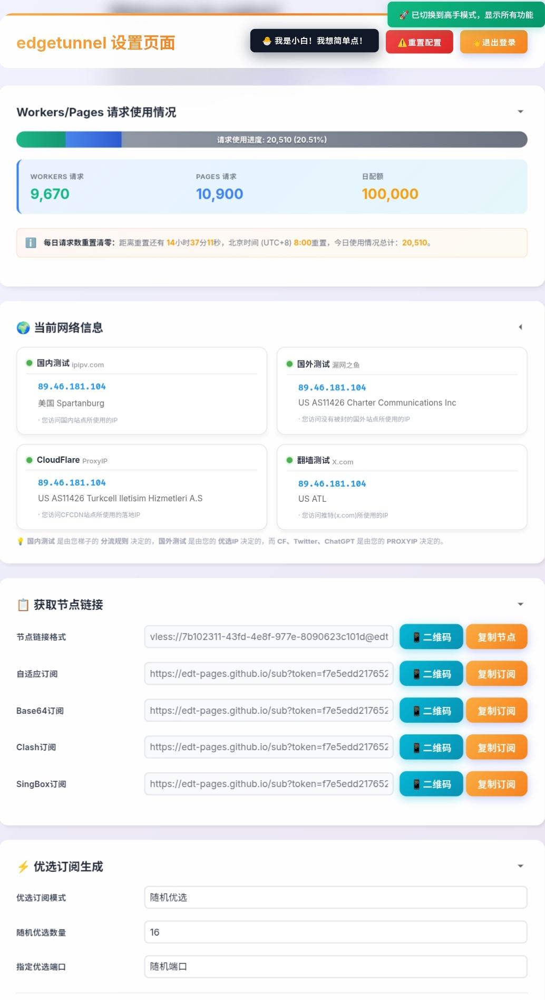

# Edgetunnel Feature Gap Analysis

## Overview

This repository provides an analysis of the features, benefits, limitations and recommended improvements for the **Edgetunnel** project.  Edgetunnel is a proof‑of‑concept implementation of proxy protocols using Cloudflare’s serverless platforms (Workers and Pages) to distribute traffic across VLESS/SOCKS5 tunnels.  The accompanying CSV file (`data/edgetunnel_feature_gap_analysis.csv`) enumerates various functional areas of the project in Chinese and details the current implementation, design flaws, user pain points, operational risks, deployment risks, security considerations and suggested priorities.

The goal of this repository is to combine structured documentation and visual resources into a single, easy‑to‑browse GitHub project.  The **data** directory contains the raw CSV used for the analysis, the **images** directory contains screenshots of the configuration and deployment process, and the **scripts** directory contains helper code to convert the CSV into a Markdown table.  By putting the dataset and screenshots side‑by‑side, developers can quickly understand the context behind each feature and replicate the steps in their own Cloudflare environment.

## File structure

```text
.
├── README.md                # This overview document
├── data/
│   └── edgetunnel_feature_gap_analysis.csv
├── images/
│   ├── edgetunnel_settings_page_1.jpg
│   ├── edgetunnel_settings_page_2.jpg
│   ├── env_variable_admin_instruction.png
│   ├── edgetunnel_settings_page_overlay.png
│   └── worker_creation_page.png
└── scripts/
    └── csv_to_markdown.py
```

## Contents

### CSV file

The `data/edgetunnel_feature_gap_analysis.csv` file contains 18 columns and 17 rows.  Each row represents a specific functional area of Edgetunnel.  The columns include:

* **`序号`** — Sequence number.
* **`功能类别`** — Feature category.
* **`具体功能`** — Specific function.
* **`详细描述`** — Detailed description.
* **`实现方式 / 部署方法`** — How the feature is currently implemented or deployed.
* **`Cloudflare 免费限制注意事项`** — Limitations when using the free tier of Cloudflare services.
* **`参考开源项目`** — Relevant open source projects (inspiration).
* **`开发灵感 / 待优化点（立即可落地）`** — Development inspirations or short‑term optimizations.
* **`当前价值/优势`** — Current value or advantages.
* **`主要短板/设计缺陷`** — Major shortcomings or design defects.
* **`用户痛点`** — User pain points.
* **`可能致命Bug / 失败模式`** — Possible fatal bugs or failure modes.
* **`运维风险`** — Operational risks.
* **`部署风险`** — Deployment risks.
* **`安全/合规风险`** — Security or compliance risks.
* **`建议优先级`** — Suggested priority (P0 indicates the highest urgency).
* **`建议补充动作`** — Further recommended actions.
* **`依据 / 参考来源`** — Sources and references for each item.

### Key insights

Based on the CSV data, several themes emerge.  The following translated summaries highlight recurring patterns:

1. **Configuration management (P0 priority).**  Edgetunnel currently relies on environment variables (e.g. `ADMIN`, `UUID`) for configuration.  Users define these variables through the Cloudflare dashboard or `.env` files and must redeploy the worker or page for changes to take effect【714184581952321†L218-L227】.  The analysis recommends moving configuration to Cloudflare’s KV/D1 storage, allowing changes to be persisted immediately without a full redeployment, and unifying configuration sources (Wrangler, Dashboard and KV) to avoid drift.  Versioning and rollback mechanisms are also suggested to mitigate operational risks.

2. **Deployment options (P0–P1).**  Three deployment methods are highlighted: using Cloudflare Workers, deploying via GitHub repositories, and uploading files directly through Pages.  Each method has unique limitations on runtime, memory, daily request quotas or file size.  Automatic update support and fallback strategies are proposed to mitigate service interruptions.

3. **Optimized subscriptions and node generation (P1).**  The tool currently scrapes and generates subscription links for VLESS or SOCKS5 tunnels.  Enhancements include customizing the subscription format, supporting more protocols and implementing real‑time performance testing to filter nodes.  Multiple UUIDs can be set via the `UUID` variable; when more than one UUID is specified, users can use a path such as `https://edtunnel.pages.dev/uuid1` to retrieve a configuration for a specific ID【714184581952321†L218-L227】.

4. **Monitoring and diagnostics (P0–P1).**  Suggested improvements include adding monitoring dashboards for Worker/Page usage, exposing network diagnostics and logs, performing hourly connectivity tests and automatically repairing failed nodes.  These features would require persistent storage (such as KV or durable objects) to track test results and status.

5. **Security considerations (P0).**  The analysis warns about exposing administrator passwords, subscription tokens and third‑party API keys in environment variables.  It recommends secret management, access control (for example, using Cloudflare Access) and obfuscation.  In addition, if you deploy Edgetunnel on Cloudflare Pages, only HTTP ports are supported by default; certain HTTPS ports are not allowed【714184581952321†L262-L274】.  When multiple ports are required, the official list of supported ports should be consulted and configured accordingly【714184581952321†L262-L274】.

For detailed comments and additional points, please refer to the CSV file.

### Images

The `images/` directory contains screenshots of relevant UI screens:

* **edgetunnel_settings_page_*.jpg** – The Edgetunnel settings page showing form fields for environment variables and configuration.
* **env_variable_admin_instruction.png** – An annotated screenshot showing how to set an `ADMIN` variable in the Cloudflare dashboard.
* **edgetunnel_settings_page_overlay.png** – A similar view with overlay.
* **worker_creation_page.png** – A screenshot of the Cloudflare Workers creation wizard.

These images can be embedded in documentation or READMEs to illustrate deployment steps or highlight UI elements.  For example:

```markdown

```

### Scripts

The `scripts/csv_to_markdown.py` script converts the CSV data into a Markdown table.  Run it with Python:

```bash
python scripts/csv_to_markdown.py data/edgetunnel_feature_gap_analysis.csv -o data/feature_analysis.md
```

This will produce a `feature_analysis.md` file containing a nicely formatted table.  You can then include that table directly into your documentation.

## License

This repository includes third‑party screenshots of the Edgetunnel project for illustrative purposes.  Please ensure you comply with the original project’s license (MIT) and Cloudflare’s terms of use when redistributing.  The analysis contained in the CSV file was produced by the user and is not an official statement from the Edgetunnel maintainers.
